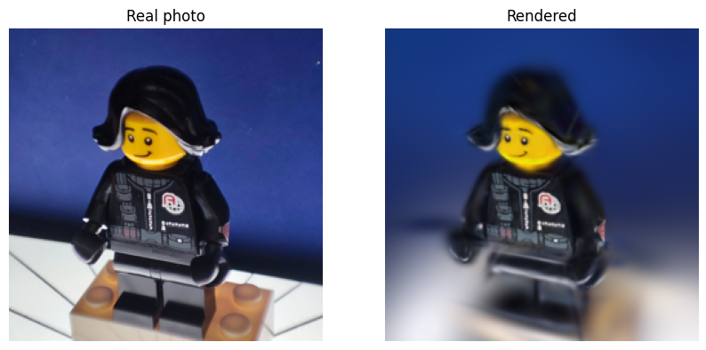

# Gaussian Splatting 3D

Turn a set of photos of a small object into a 3D Gaussian Splatting model. The whole pipeline is
written from scratch in PyTorch inside one notebook, so every step is easy to read and change.



## How it works

1. **Feature extraction (COLMAP)**: finds distinct points in every photo.
2. **Matching (COLMAP)**: compares every photo with every other photo and links the same points.
3. **Structure-from-Motion (COLMAP)**: finds the camera position of every photo and builds a sparse
   3D point cloud.
4. **Gaussian initialization**: turns every 3D point into a Gaussian with a position, size,
   rotation, opacity and color.
5. **Training**: renders the Gaussians from the camera of a random photo, compares the render with
   the real photo (L1 loss) and updates the Gaussians.
6. **Export**: saves a spinning GIF and a `.ply` file that you can open in any web splat viewer
   (for example [SuperSplat](https://superspl.at/editor)).

## Project structure

```
gaussian-splatting.ipynb           # the full pipeline
images/                            # your training photos
example/                           # example photos that show how to shoot
scene/                             # outputs: COLMAP files, checkpoints, spin.gif, minifig.ply
visualization/steps-visualization.html  # visual explanation of the steps
```

## Setup

The notebook is made to run on [Kaggle](https://www.kaggle.com/) with a GPU. It also runs on CPU,
but training is much slower.

1. Upload your photos to Kaggle as a dataset.
2. Open `gaussian-splatting.ipynb` and set `images_dir` in the **Paths** cell to your dataset path.
3. Run all cells. The notebook installs COLMAP with `apt-get` by itself.

To run locally, install [COLMAP](https://colmap.github.io/install.html) and the Python packages,
then change the paths in the **Paths** cell:

```bash
pip install -r requirements.txt
```

## Outputs

All outputs are saved to the `scene` folder:

| File | Description |
| --- | --- |
| `database.db` | COLMAP features and matches |
| `sparse/` | COLMAP camera poses and sparse point cloud |
| `gaussians_init.pt` | Gaussians before training |
| `gaussians_trained.pt` | Gaussians after training |
| `spin.gif` | Renders of the trained model from every camera |
| `minifig.ply` | Trained model for splat viewers |

## How to take good photos for the training?

The quality of the model depends mostly on the photos. Follow these steps (see the `example`
folder for sample shots):

1. **Choose an object.** Small objects with some texture and detail work best.
2. **Place it somewhere easy to shoot.** You should be able to take photos of it comfortably from
   every side.
3. **Keep the camera steady.** A tripod is not needed, you can hold the camera with your hands,
   but try to keep it as stable as possible to avoid blurry photos.
4. **Take 3 photos from each angle:**
   - one straight from the front,
   - one slightly from below, looking up,
   - one slightly from above, looking down.
5. **Rotate the object 15° clockwise and repeat step 4.** Continue until the object has made a full
   360° turn. In the end you will have (360 / 15) × 3 = **72 photos**.
6. **Use a plain background.** If possible, keep the background a single color.
7. **Capture only the object.** Try to keep other things around the object out of the frame.
8. **Put all photos in one folder.** You do not need to sort or rename them. Just put all of them
   into the `images` folder."# gaussian-splatting-scratch" 
